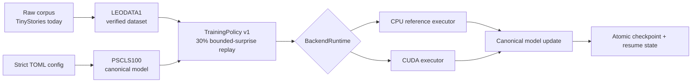

# Leo v1.0.0

<p align="center">
  <strong>A sparse recurrent byte-learning system with a CPU reference backend and a custom NVIDIA CUDA backend.</strong>
</p>

<p align="center">
  <a href="https://github.com/saravanaspar/Leo/actions/workflows/ci.yml"></a>
  <a href="https://github.com/saravanaspar/Leo/actions/workflows/gpu-ci.yml"></a>
  <a href="LICENSE"></a>
  
  
</p>

<p align="center">
  <a href="#quick-start">Quick start</a> ·
  <a href="#tinystories-testing-dataset">TinyStories</a> ·
  <a href="#architecture">Architecture</a> ·
  <a href="#gpu-execution">GPU</a> ·
  <a href="#testing-and-validation">Testing</a> ·
  <a href="CONTRIBUTING.md">Contributing</a> ·
  <a href="SECURITY.md">Security</a>
</p>

> [!IMPORTANT]
> **Current public development and quality testing is specifically centered on the [TinyStories dataset](https://huggingface.co/datasets/roneneldan/TinyStories).** Leo is research-oriented software. Passing repository tests proves implementation invariants; it does not by itself prove model quality, generalization, or production readiness.

Leo v1.0.0 is a clean durability baseline for fresh training and long-lived experiments. It keeps **FP32 learning semantics**, **30% bounded-surprise replay** in the standard configurations, strict artifact identity, checkpoint/resume safety, a CPU reference path, and execution-only CUDA optimization.

## Project status

| Area | Status |
| --- | --- |
| CPU reference backend | Supported |
| Single-GPU CUDA training | Supported |
| CUDA execution autotuning | Supported, execution-only |
| CUDA Graph sparse apply/reset | Supported when driver APIs allow it |
| Async pinned H2D/D2H pipeline | Supported |
| Cooperative fused wavefront | Preferred when hardware supports it |
| Multi-GPU training | **Experimental** batch-end device mean |
| FP16/BF16 training | Not part of v1.0.0 |
| Dynamic topology growth | Not part of v1.0.0 |
| Pre-v1 artifact compatibility | Intentionally not supported |

### Core v1 guarantees

- **One learning contract:** CPU/GPU selection changes execution location, not learning policy.
- **FP32 only:** no hidden FP16/BF16/approximate-math training path.
- **30% replay:** standard configurations keep bounded-surprise replay enabled at `0.30`.
- **Strict artifacts:** datasets, checkpoints, and resume state are identity-bound and validated.
- **One CUDA ABI source:** Rust/CUDA pointer/config layouts come from `crates/leo-core/cuda_abi.def`.
- **Execution-only tuning:** CUDA tuning cannot change logical `--workers`, replay fraction, precision, update barriers, or learning equations.

<details>
<summary><strong>What Leo provides</strong></summary>

- model initialization
- train / resume / fresh-run flows
- CPU and CUDA backends
- held-out and training-set evaluation
- text generation and explicit teaching permissions
- inspect / checkpoint / rollback
- training and frozen benchmarks
- single-GPU CUDA verification and hardware profiling
- optional experimental multi-GPU synchronization

</details>

---

## Quick start

### 1. Requirements

- Rust **1.85+**
- Python **3.12+** for repository/data tooling
- NVIDIA driver + CUDA toolkit for GPU execution
- `hf` CLI when downloading TinyStories automatically

Clone and enter the repository:

```bash
git clone https://github.com/saravanaspar/Leo.git
cd Leo
```

Build:

```bash
cargo build --release -p leo-cli
```

The binary is:

```text
target/release/leo
```

Show CLI help:

```bash
./target/release/leo --help
```

Run the CPU/static repository gate:

```bash
bash ./scripts/check.sh
```

> [!NOTE]
> `Cargo.lock` should be committed for the v1.0.0 application baseline. Dependency changes should be explicit, reviewed, and validated rather than silently drifting between training environments.

---

## TinyStories testing dataset

Leo does **not** vendor the TinyStories corpus. `scripts/data.sh` downloads and verifies the upstream files when needed.

**Dataset:** [roneneldan/TinyStories on Hugging Face](https://huggingface.co/datasets/roneneldan/TinyStories)<br>
**Paper:** [TinyStories: How Small Can Language Models Be and Still Speak Coherent English?](https://arxiv.org/abs/2305.07759)

The repository currently prepares:

```text
data/prepared/
├── tinystories.train.bytes
├── tinystories.train.idx
├── tinystories.valid.bytes
├── tinystories.valid.idx
└── manifest.json
```

The validation split is held out. Do not train on `tinystories.valid.*`.

Prepare the default dataset:

```bash
bash ./scripts/data.sh
```

General syntax:

```text
./scripts/data.sh \
  [raw-directory] \
  [prepared-directory] \
  [train-story-limit] \
  [valid-story-limit] \
  [train-byte-limit] \
  [valid-byte-limit]
```

<details>
<summary><strong>Exact TinyStories provenance currently pinned by Leo</strong></summary>

```text
repository: roneneldan/TinyStories
revision:   5485261731eaac25dd8e5ebbc3839d0a9870b185
revision URL: https://huggingface.co/datasets/roneneldan/TinyStories/tree/5485261731eaac25dd8e5ebbc3839d0a9870b185

TinyStories-train.txt
sha256: c5cf5e22ff13614e830afbe61a99fbcbe8bcb7dd72252b989fa1117a368d401f

TinyStories-valid.txt
sha256: 94e431816c4cce81ff71e4408ff8d3bda9a42e8d2663986697c3954288cb38b4
```

These values come from `scripts/data.sh`. Prepared artifacts record source repository, revision, source checksums, and their own identity.

</details>

> [!CAUTION]
> TinyStories is an **external dataset** and is not covered by Leo's Apache-2.0 software license. The upstream dataset card currently lists `cdla-sharing-1.0`; always review the current dataset card and terms before downloading, redistributing, or using it in another context.

See [docs/TESTING.md](docs/TESTING.md) for the full validation ladder and [docs/REPRODUCIBILITY.md](docs/REPRODUCIBILITY.md) for experiment identity guidance.

---

## Architecture



Persistent learned state is separated from transient per-document execution state. A fresh executor can therefore start from a canonical model without inheriting membrane, activation, fatigue, eligibility, delay-ring, selection, or scratch state from another document.

### Repository layout

```text
Leo/
├── .github/                 # CI, issue forms, PR template, dependency updates
├── configs/                 # supported v1 model/training configs
├── crates/
│   ├── leo-cli/             # CLI + training lifecycle boundary
│   ├── leo-core/            # model, runtime, CPU/CUDA execution
│   ├── leo-data/            # verified dataset artifacts
│   └── leo-format/          # checkpoint format and persistence
├── docs/                    # semantics, formats, design, testing
├── python/                  # repository/data validation tooling
├── scripts/                 # data, train, evaluate, CI/GPU/profile helpers
├── tests/                   # reference validation tests
├── CONTRIBUTING.md
├── SECURITY.md
└── README.md
```

<details>
<summary><strong>Read the design contracts</strong></summary>

- [Product requirements](docs/PRD.md)
- [Technical design](docs/TDD.md)
- [Execution and learning semantics](docs/SEMANTICS.md)
- [Artifact formats](docs/FORMATS.md)
- [Backend ADR](docs/ADR-0001-EXECUTION-BACKENDS.md)
- [Testing strategy](docs/TESTING.md)
- [Reproducibility](docs/REPRODUCIBILITY.md)

Historical GPU stage documents remain in `docs/` as implementation history; the current v1 contract is defined by the files above and the code.

</details>

---

## Initialize and train

Create a run directory and model:

```bash
mkdir -p runs/quality/my-run

./target/release/leo init \
  --config configs/tinystories.toml \
  --output runs/quality/my-run/leo.pscls
```

### Recommended single-GPU example

```bash
CUDA_VISIBLE_DEVICES=0 \
./target/release/leo train \
  --model runs/quality/my-run/leo.pscls \
  --train-bytes data/prepared/tinystories.train.bytes \
  --train-index data/prepared/tinystories.train.idx \
  --valid-bytes data/prepared/tinystories.valid.bytes \
  --valid-index data/prepared/tinystories.valid.idx \
  --validation-stories 100 \
  --passes 1 \
  --workers 64 \
  --backend gpu \
  --fresh-run
```

Use `--fresh-run` only when intentionally starting a new training operation and discarding compatible prior resume state for that model.

### Scripted training

```text
./scripts/train.sh \
  <prepared-data-directory> \
  <run-directory> \
  [config] \
  [passes] \
  [max-stories] \
  [workers] \
  [max-input-bytes] \
  [backend] \
  [validation-stories]
```

Example:

```bash
CUDA_VISIBLE_DEVICES=0 \
bash ./scripts/train.sh \
  data/prepared \
  runs/quality/my-run \
  configs/tinystories.toml \
  1 \
  100000 \
  64 \
  "" \
  gpu \
  100
```

<details>
<summary><strong>Resume, CPU training, and constrained runs</strong></summary>

Resume an interrupted run by repeating the same training command **without** `--fresh-run`.

CPU reference training:

```bash
./target/release/leo train \
  --model runs/quality/my-run/leo.pscls \
  --train-bytes data/prepared/tinystories.train.bytes \
  --train-index data/prepared/tinystories.train.idx \
  --passes 1 \
  --workers 1 \
  --backend cpu
```

Limit by story count:

```bash
./target/release/leo train \
  --model runs/quality/my-run/leo.pscls \
  --train-bytes data/prepared/tinystories.train.bytes \
  --train-index data/prepared/tinystories.train.idx \
  --passes 1 \
  --max-stories 10000 \
  --workers 64 \
  --backend gpu
```

Limit by raw input bytes:

```bash
./target/release/leo train \
  --model runs/quality/my-run/leo.pscls \
  --train-bytes data/prepared/tinystories.train.bytes \
  --train-index data/prepared/tinystories.train.idx \
  --passes 1 \
  --max-bytes 100000000 \
  --workers 64 \
  --backend gpu
```

</details>

---

## GPU execution

The CUDA backend may optimize **execution only**. It keeps the v1 learning contract unchanged while using:

- persistent device model buffers
- exact touched/learning worklists
- sparse delta application
- adaptive physical lane chunks
- cooperative-grid wavefront fusion with a compatibility fallback
- hardware/model/driver-specific execution-plan tuning
- SHA-256-keyed NVRTC PTX caching
- pinned host staging
- separate transfer and compute streams
- event-ordered H2D/compute/D2H overlap
- one-batch-ahead verified dataset prefetch
- CUDA Graph replay for the stable sparse apply/reset sequence
- sampled runtime telemetry

The logical `--workers` batch is never autotuned because it defines the canonical batch whose sparse deltas are mean-reduced.

Execution/PTX profiles are cache data, not model state. They live under one of:

```text
${LEO_CACHE_DIR}/cuda
${XDG_CACHE_HOME}/leo/cuda
~/.cache/leo/cuda
```

Deleting that cache forces recompilation/retuning without deleting learned parameters.

### GPU verification

```bash
bash ./scripts/check_gpu.sh
```

### Hardware-counter profiling

Requires NVIDIA Nsight Compute (`ncu`):

```bash
bash ./scripts/profile_cuda.sh \
  runs/quality/my-run/leo.pscls \
  data/prepared/tinystories.train.bytes \
  data/prepared/tinystories.train.idx \
  64 256 leo-cuda-profile
```

The GPU GitHub Actions workflow only runs when the repository/org variable `LEO_GPU_RUNNER` names a configured GPU runner. Otherwise it safely skips instead of pretending GPU validation occurred.

<details>
<summary><strong>Experimental multi-GPU mode</strong></summary>

Enable it explicitly:

```bash
CUDA_VISIBLE_DEVICES=0,1 LEO_MULTI_GPU=1 \
./target/release/leo train \
  --model runs/quality/my-run/leo.pscls \
  --train-bytes data/prepared/tinystories.train.bytes \
  --train-index data/prepared/tinystories.train.idx \
  --passes 1 \
  --workers 64 \
  --backend gpu
```

Current synchronization is:

```text
gpu_multi_device_batch_mean_experimental
```

Multi-GPU training performs batch-end device averaging and therefore reports:

```text
exact_single_gpu_wavefront_equivalence=false
```

Do not treat multi-GPU results as byte-for-byte equivalent to the single-GPU wavefront update order.

</details>

---

## Evaluate and generate

Held-out evaluation:

```bash
./target/release/leo eval \
  --model runs/quality/my-run/leo.pscls \
  --bytes data/prepared/tinystories.valid.bytes \
  --index data/prepared/tinystories.valid.idx \
  --stories 100 \
  --generation-stories 4 \
  --prompt "Once upon a time" \
  --backend gpu
```

Generate text:

```bash
./target/release/leo prompt \
  --model runs/quality/my-run/leo.pscls \
  --text "Once upon a time" \
  --max-bytes 500 \
  --temperature 0.8 \
  --backend gpu
```

<details>
<summary><strong>More CLI recipes</strong></summary>

Training benchmark:

```bash
./target/release/leo benchmark \
  --train \
  --model runs/quality/my-run/leo.pscls \
  --bytes data/prepared/tinystories.train.bytes \
  --index data/prepared/tinystories.train.idx \
  --stories 1024 \
  --workers 64 \
  --backend gpu
```

Frozen held-out benchmark:

```bash
./target/release/leo benchmark \
  --model runs/quality/my-run/leo.pscls \
  --bytes data/prepared/tinystories.valid.bytes \
  --index data/prepared/tinystories.valid.idx \
  --stories 100 \
  --backend gpu
```

Teach text explicitly:

```bash
./target/release/leo teach \
  --model runs/quality/my-run/leo.pscls \
  --permission training \
  --text "Text to teach." \
  --backend gpu
```

Inspect:

```bash
./target/release/leo inspect \
  --model runs/quality/my-run/leo.pscls \
  --json
```

Checkpoint:

```bash
./target/release/leo checkpoint \
  --model runs/quality/my-run/leo.pscls
```

Rollback:

```bash
./target/release/leo rollback \
  --model runs/quality/my-run/leo.pscls \
  --generation 3
```

Backend information:

```bash
./target/release/leo backend \
  --backend auto \
  --model runs/quality/my-run/leo.pscls \
  --json
```

</details>

---

## Testing and validation

For normal contributions:

```bash
cargo fmt --check
cargo build
cargo test
cargo clippy -- -D warnings
bash ./scripts/check.sh
```

For changes that affect CUDA execution, kernels, ABI, launch planning, or GPU-visible training behavior, also run on a suitable NVIDIA machine:

```bash
bash ./scripts/check_gpu.sh
```

| Gate | Purpose |
| --- | --- |
| `cargo fmt --check` | canonical Rust formatting |
| `cargo build` | workspace compilation |
| `cargo test` | Rust behavioral/unit/integration tests |
| `cargo clippy -- -D warnings` | warning-free Rust lint gate |
| `scripts/check.sh` | Python/source/ABI/config + Rust repository gate |
| `scripts/check_gpu.sh` | real CUDA/NVRTC/conformance/autotuning smoke |
| `scripts/profile_cuda.sh` | optional Nsight performance investigation |

Read [docs/TESTING.md](docs/TESTING.md) before making changes to training semantics or CUDA execution.

---

## Contributing

Contributions are welcome. Start with [CONTRIBUTING.md](CONTRIBUTING.md).

Useful paths:

- [Open an issue](https://github.com/saravanaspar/Leo/issues)
- [Pull requests](https://github.com/saravanaspar/Leo/pulls)
- [Changelog](CHANGELOG.md)
- [Support guidance](SUPPORT.md)
- [Code of Conduct](CODE_OF_CONDUCT.md)

Performance PRs must preserve the v1 semantic contract unless they explicitly propose and justify a semantic/versioned change. "Faster" is not accepted as a reason to silently change replay, arithmetic precision, logical batching, update ordering, or dataset identity.

---

## Security

Please do **not** publish exploitable security reports in a public issue. Follow [SECURITY.md](SECURITY.md) for responsible reporting guidance.

---

## License and external data

Leo source code is licensed under the [Apache License 2.0](LICENSE).

TinyStories is an external project/dataset. Its files, metadata, paper, and licensing are governed by their respective upstream terms. Leo's Apache-2.0 license does not relicense TinyStories.

---

## Acknowledgements

Current public development/testing uses **TinyStories** by Ronen Eldan and Yuanzhi Li as a compact language-learning benchmark corpus. See the [dataset](https://huggingface.co/datasets/roneneldan/TinyStories) and [paper](https://arxiv.org/abs/2305.07759).

If you use Leo in research, see [CITATION.cff](CITATION.cff).
